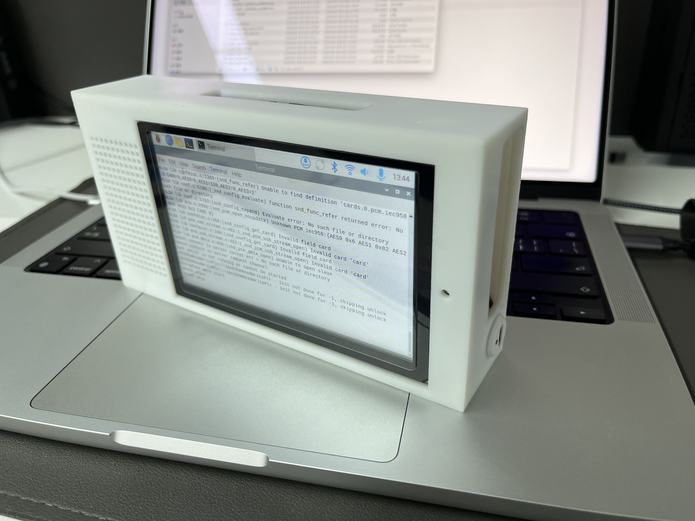

# bangbooCore

项目基于树莓派搭建, 用于打造家庭Ai语音对话助手. 

* 使用OpenAI API, 默认配置为DeepSeek. 支持其他的在线大模型, 或者可以使用ollama搭建的本地大模型(代码中有示例)
* 大致分为三个部分: 语音对话部分, 语音识别部分, 大模型部分.
    * 树莓派充当语音对话部分: 接收语音, 上传语音, 接收回复, tts朗读.
    * 语音识别部分: 接收语音, 识别语音, 与大模型部分交互, 返回大模型输出.

## 如何使用

1. 带指令的对话. 与其进行语音交互的时候, 需要添加唤醒指令: “xx同学” 以防止其将识别到的所有语音都进行回复. 使用举例: “xx同学, 天空为什么是蓝色的.”
    * “xx”可以是任何词, 不叫也行, 主要为了防止对话的前几个字识别不到.
2. 连续语音对话. 语音指令为: “连续语音对话开启”, 接下来的语音将不再需要唤醒词. 关闭指令为: “连续语音对话关闭”
3. 具有打断回复功能: 当它正在语音回复的时候, 如果用户说话, 它会暂停当前语音, 当用户说完再接着说.

## 使用的技术清单

1. 外壳模型: autodesk fusion360
2. 人声检测: webrtcvad
3. ASR: senseVoice
4. TTS: edge-tts
5. 短期记忆: langchain.graph
6. 本地大模型: ollama

## 语音识别与大模型部分

语音识别部分运行在公网的服务器上

语音识别部分可以跑在树莓派上, 运行在公网服务器上一方面是减少树莓派的电池压力, 一方面也是让树莓派可以脱离局域网工作.

本地大模型我自己使用了ollama的qwen2.5 7b 与 llama3.1 8b. deepseek的几个小内存版本本地大模型实际体验不怎么好.

公网服务器运行frps, 电脑运行frpc, 吧ollama端口映射到服务器上, 这样服务器就能像访问deepseek一样访问本地的ollama了.

## 代码运行环境搭建

待补充

## 主要零件相关
树莓派: 树莓派4B, 价格根据购买渠道不同不明.

* 如果语音识别部分要跑在树莓派中, 至少需要4G内存, 语音识别不怎么吃处理器性能, 树莓派4B足够用了.
* 树莓派4B单运行语音对话模式, PowerSave模式, 整体功耗约4W.

外壳: 外壳是用的嘉立创的光固化. 约40元. 注意: 当前外壳模型存在一些问题: 喇叭塞不进去, 需要剪掉一部分喇叭的边沿, 待修复.

语音模块: 淘宝约50元 [IMG_9180](assets/IMG_9180.jpeg)

电池供电: 当前我选的UPS模块实际体验不好, 待后续更新.

屏幕: IPS 5寸电容触摸屏, 使用DSI接口, 150元. 淘宝有一家叫“DIY显示屏”的, 买的他家的.

## 参考

[ASR-LLM-TTS](https://github.com/ABexit/ASR-LLM-TTS)
